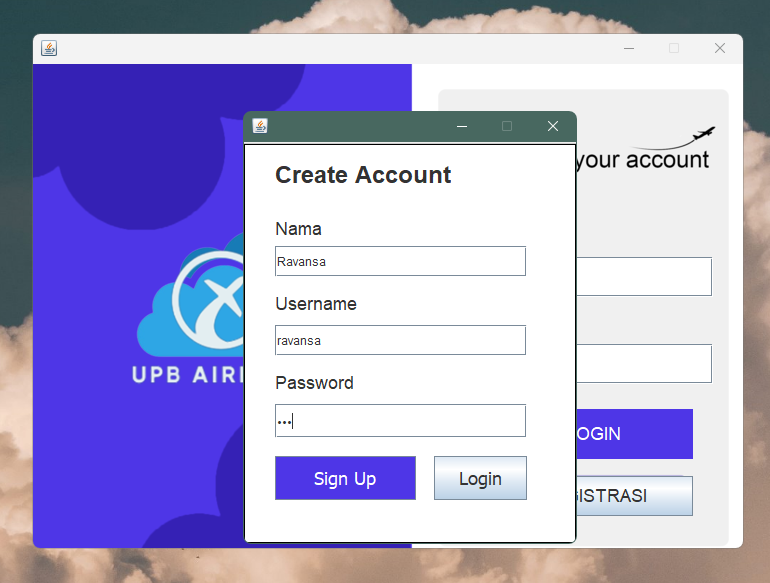
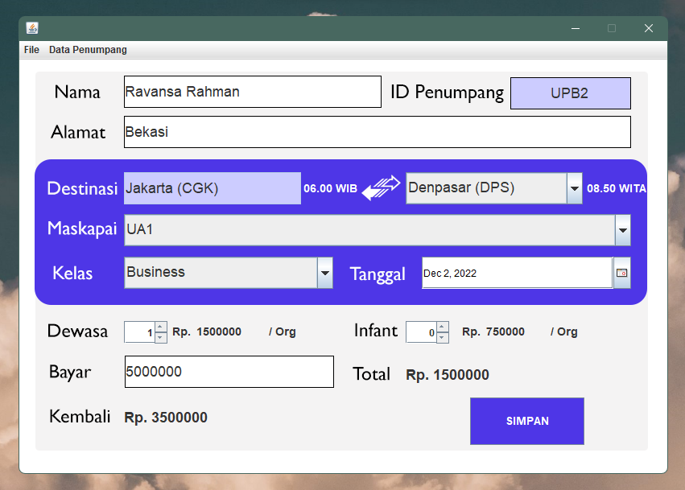

# UI-Design-And-Implementation-In-NetBeans
This Project is an upgrade from https://github.com/ma-mur/netbeans-crud-sederhana-aplikasi-tiket-kereta-api to aplikasi tiket pesawat(Airplane Ticket)

#### Nama : Ravansa Rahman
#### NIM : 312110103
#### Kelas : TI.21.A2
#### MatKul : Pemrograman mobile

### Penjelasan Program
Ini adalah Program Pembelian tiket Pesawat

Pertama Bentuk dari menu login

Kedua Melakukan Registrasi

Ketiga Melakukan login

KeEmpat Melakukan Input data dan menyimpanya

Kelima Print Out dari Fungsi Jasper

## Sekian Dan Terimakasih
Jika file ingin di takedown silahkan hubungi saya
